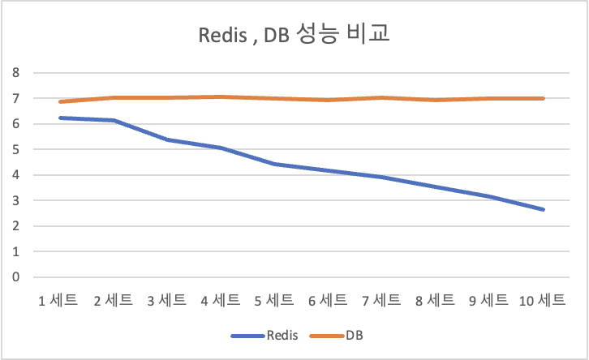

# 환경설정

- 파이썬 버전 : 3.10
- 웹 프레임워크 : Fastapi
- DB: Postgresql 14.4 (Azure Database for PostgreSQL 1vCore, 2 GiB 메모리)
- Redis : 6.2.7 (Redis-stack-server 로컬에서 운용)

# DB 스키마

### board(게시글)

```sql
create table board
(
    id      serial
        primary key,
    title   varchar(32) default '제목 없음'::character varying not null,
    content varchar(200)
);
```

### comment (댓글)

```sql
create table comment
(
    id       bigserial
        constraint comment_pk
            primary key,
    content  varchar(100) not null,
    board_id bigint       not null
        constraint comment_board_id_fk
            references board
            on update set null on delete set null
);

create unique index comment_id_uindex
    on comment (id);
```

### user(사용자)

```sql
create table "user"
(
    id           bigserial
        constraint user_pk
            primary key,
    username     varchar(32)  not null,
    password     varchar(100) not null,
    is_superuser boolean default false
);

create unique index user_id_uindex
    on "user" (id);

create unique index user_username_uindex
    on "user" (username);
```

# RDBMS 와 Redis 성능 비교

### 목적

순수 db 쿼리와 비교하여서 Redis 캐싱 성능을 알아본다.

## 설정 환경

id가 1 ~ 10000인 게시글(board)만 대상으로 실험을 진행한다. 

매 탐색 마다 파이썬 random.randint 함수를 사용하여서 1~10000 중 하나 정수를 추출하여 게시글을 탐색한다.

한 세트는 1000개 게시글을 조회하며 총 10회를 진행한다.

## 실험 방식

### redis를 사용하는 경우

 redis에서 게시글 데이터를 먼저 탐색한다. 만약 redis에 탐색하고자 하는 데이터가 존재하지 않으면, DB에서 데이터를 탐색한 후에 redis에 올려둔다. 

### 순수 DB 쿼리를 사용하는 경우

ORM을 사용하지 않고, 순수 sql문으로 게시글을 탐색한다.  

## 결과

세트가 진행됨에 따라서 Redis 를 통한 조회 실행 시간이 짧아졌다. 무작위 탐색 횟수가 늘어남에 따라서 Redis에 히트 확률이 높아지기 때문에 위와 같은 결과가 나온 것으로 보인다. 

### 한계

Postgresql DB는 remote 환경에서 실행되고 있고, Redis는 로컬에서 실행되고 있다. 환경 설정 차이라는 변수 때문에 엄밀한 성능비교가 되지 않을 수 있다.
